

  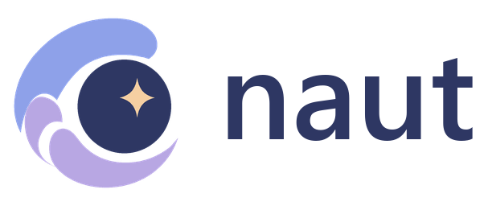

<strong>A Navigator for Your Things Worth Keeping</strong>

  <a href="https://github.com/secondshift-dv/naut/releases/tag/v0.0.3"><strong>Télécharger Naut v0.0.3</strong></a>
  ·
  <a href="https://secondshift-dv.github.io/naut/"><strong>Voir la démo</strong></a>
  ·
  <a href="docs/README.md"><strong>Documentation</strong></a>

  <strong>README:</strong>
  <a href="README.md">English</a> ·
  <a href="README.de.md">Deutsch</a> ·
  <a href="README.es.md">Español</a> ·
  <a href="README.fr.md">Français</a> ·
  <a href="README.id.md">Bahasa Indonesia</a> ·
  <a href="README.ja.md">日本語</a> ·
  <a href="README.ko.md">한국어</a> ·
  <a href="README.zh-Hans.md">简体中文</a>
  

  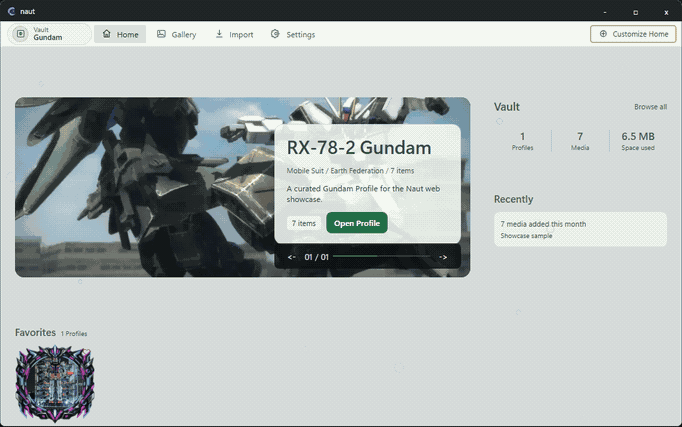

## Votre collection, faite pour être explorée.

Naut est un **gestionnaire de collection multimédia local-first pour Windows**. Il transforme images, vidéos et modèles 3D compatibles en collections centrées sur des Profiles, à reconnaître, présenter et explorer sans céder le contrôle à un service cloud.

## Fonctionnalités phares

<table>
<tr>
<td width="50%" valign="top">
<a href="docs/face-intelligence.md">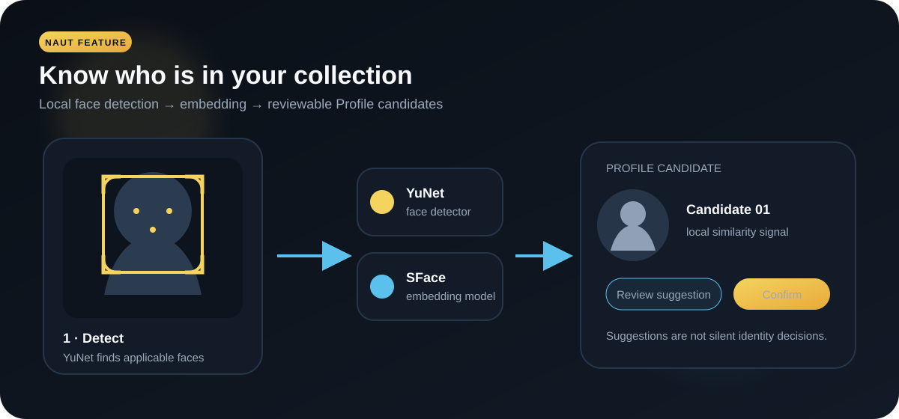</a> 
<strong>Face Intelligence</strong> 
YuNet détecte les visages applicables, SFace produit des embeddings et Naut peut proposer des candidats de Profile à partir d'échantillons d'identité confirmés. Le traitement reste local et les suggestions restent vérifiables.
</td>
<td width="50%" valign="top">
<a href="docs/figures.md">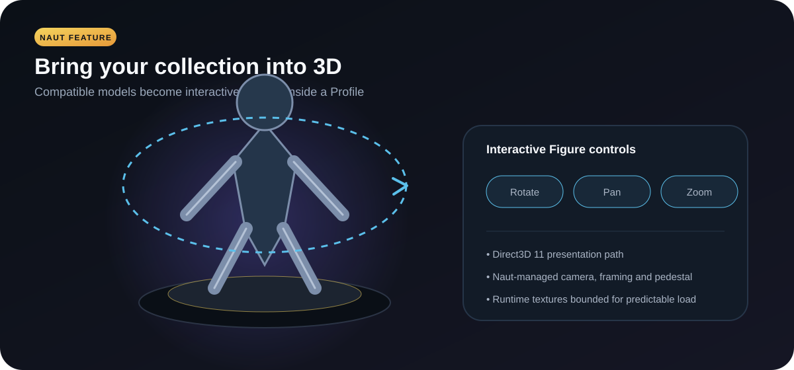</a> 
<strong>Figures 3D interactives</strong> 
Les modèles compatibles peuvent devenir des Figures interactives avec rotation, déplacement, zoom, cadrage géré par Naut et limites de texture à l'exécution.
</td>
</tr>
<tr>
<td width="50%" valign="top">
<a href="docs/import-media.md">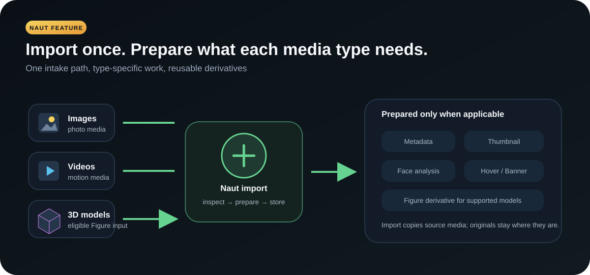</a> 
<strong>Import média intelligent</strong> 
Le même pipeline ne prépare que ce dont chaque type de média a besoin : métadonnées, miniatures, médias vidéo de présentation bornés, analyse faciale si applicable et dérivés Figure pour les modèles pris en charge.
</td>
<td width="50%" valign="top">
<a href="docs/customization.md">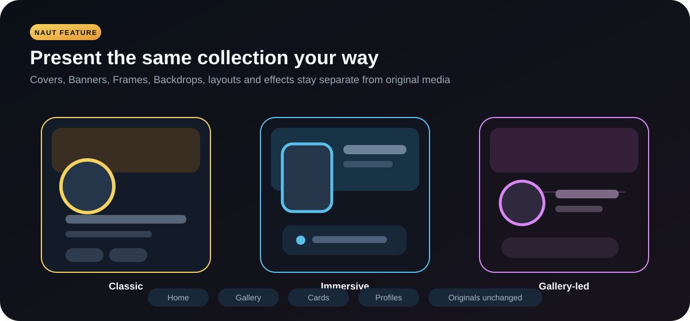</a> 
<strong>Présentation sans modifier les originaux</strong> 
Personnalisez Home, Gallery, Cards, Profiles, Covers, Banners, Frames, Backdrops, layouts, effets et themes sans modifier les fichiers originaux.
</td>
</tr>
<tr>
<td width="50%" valign="top">
<a href="docs/languages.md">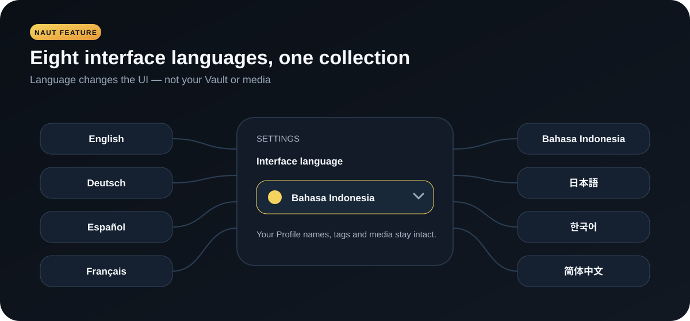</a> 
<strong>8 langues d'interface</strong> 
Naut fournit English, Bahasa Indonesia, 日本語, 한국어, 简体中文, Deutsch, Français et Español. La langue de l'interface ne réécrit ni le Vault ni les métadonnées.
</td>
<td width="50%" valign="top">
<a href="docs/vault.md">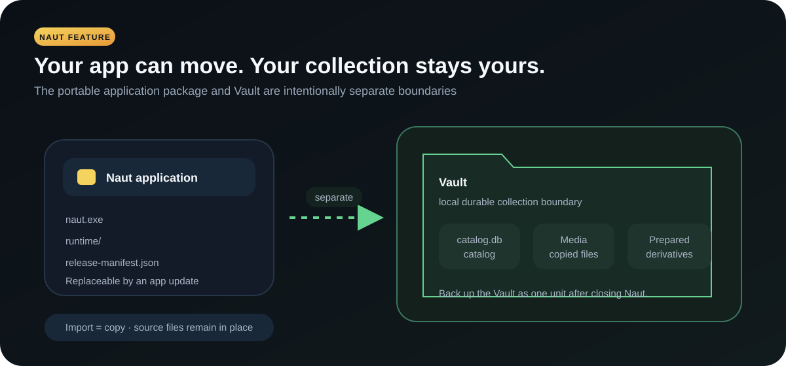</a> 
<strong>Vault local et portable</strong> 
Le paquet applicatif portable et le Vault sont séparés. L'import copie les fichiers dans le Vault et laisse les sources à leur emplacement d'origine.
</td>
</tr>
</table>

## Pourquoi Naut

- **Les Profiles avant les dossiers.** Un Profile peut représenter une personne, un personnage, un projet, un objet, un sujet ou toute identité de collection.
- **Contrôle local par conception.** La collection de référence vit dans le Vault choisi.
- **Préparé pour la navigation.** Naut crée des dérivés de présentation bornés sans modifier les originaux.
- **La 3D est optionnelle.** L'usage normal ne nécessite ni GPU dédié ni Figure.
- **Application portable, collection durable.** Une mise à jour de l'application ne remplace pas le Vault.

## Voir Naut en action

<table>
<tr>
<td width="50%">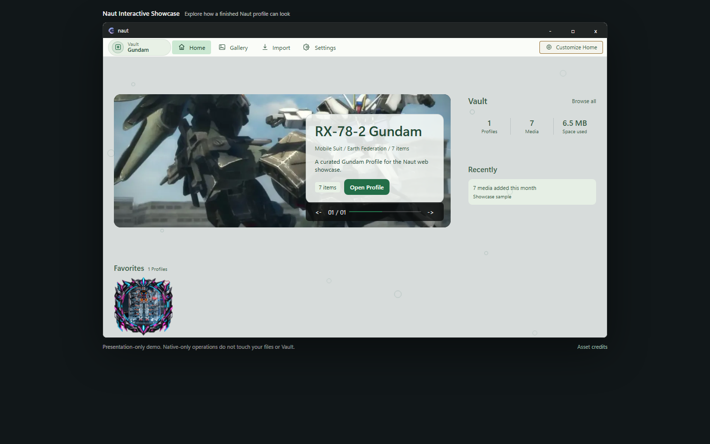 Home — Profiles mis en avant, activité et contexte de collection.</td>
<td width="50%">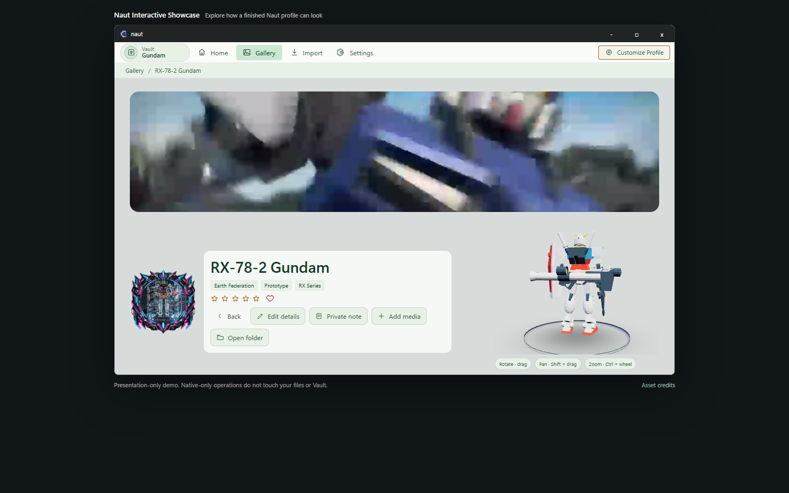 Profile — identité, médias, présentation et Figure interactive optionnelle.</td>
</tr>
<tr>
<td width="50%">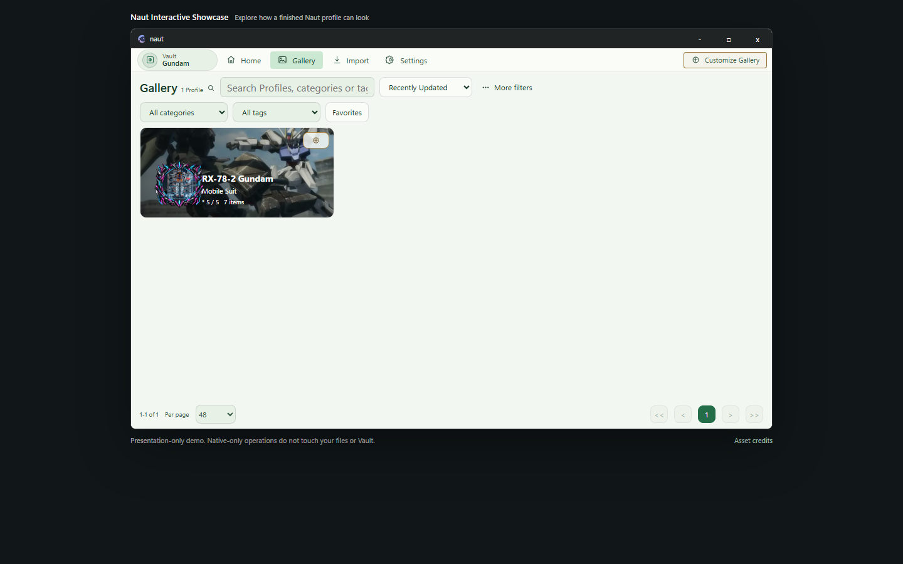 Gallery — navigation, recherche, filtres et présentation des Cards.</td>
<td width="50%">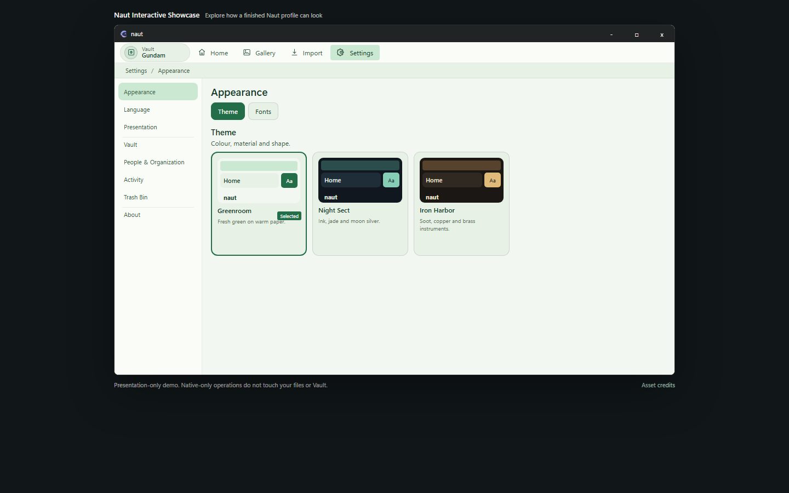 Settings — Theme, langue, contrôles du Vault et options système.</td>
</tr>
</table>

## Démarrage rapide

1. Téléchargez **Naut v0.0.3** depuis le [GitHub Release](https://github.com/secondshift-dv/naut/releases/tag/v0.0.3) officiel.
2. Extrayez le ZIP complet dans un dossier normal.
3. Lancez `naut.exe`.
4. Choisissez où conserver le Vault.
5. Importez des médias ou créez un Profile puis utilisez **Add media**.

`runtime/` et `release-manifest.json` doivent rester à côté de `naut.exe`. Pour un aperçu navigateur sans toucher aux fichiers locaux ni au Vault : [Interactive Showcase](https://secondshift-dv.github.io/naut/).

## Configuration requise

L'expérience Naut normale est volontairement plus légère que la charge optionnelle des Figures.

| | Minimum | Recommended |
| --- | --- | --- |
| **OS** | Windows 10/11 64-bit | Windows 11 64-bit |
| **CPU** | x86-64, 2 cœurs | x86-64 moderne, 4+ cœurs |
| **RAM** | 8 GB | 16 GB |
| **GPU** | Graphiques intégrés pour l'usage normal | GPU intégré/dédié Direct3D 11 pour des Figures plus fluides |
| **Écran** | 1280 × 720 | 1920 × 1080 ou plus |
| **Espace app/update** | 1.5 GB | 1.5 GB+ sur SSD |

Le stockage du Vault est séparé et dépend de la collection. Voir [Naut v0.0.3 System Requirements](docs/system-requirements.md).

## Documentation

Commencez par [Naut Documentation](docs/README.md) : Import Media, Face Intelligence, Profiles, Vault, Customization, Languages, 3D Figures, System Requirements et Troubleshooting.

Contributor-facing build, licensing, and Presentation Pack material lives under [docs/development](docs/development/).

## Source et releases

Le dépôt privé **naut-dv** est l'autorité d'ingénierie. Ce dépôt **naut** organisé est la surface publique de source, contribution, démo et releases officielles.

Le source appartenant à Naut est **Source Available** sous PolyForm Shield 1.0.0 ; les composants tiers conservent leurs propres licences. Voir [LICENSE](LICENSE), [licensing scope](docs/development/licensing.md), [brand policy](BRAND-POLICY.md), [contributing](CONTRIBUTING.md), [security](SECURITY.md) et [third-party notices](THIRD-PARTY-NOTICES.txt).

Les binaires officiels et métadonnées de mise à jour signées sont distribués uniquement via les **GitHub Releases** officielles de `secondshift-dv/naut`.
