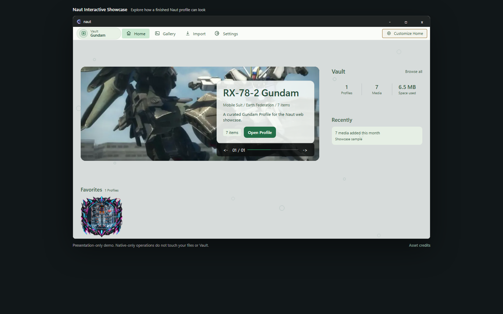
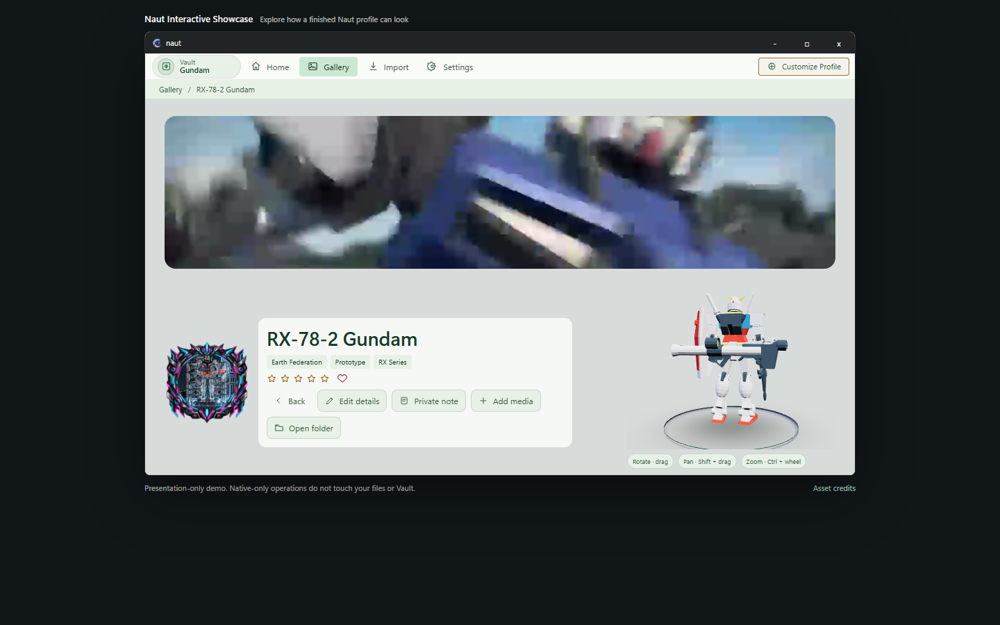

  

<strong>A Navigator for Your Things Worth Keeping</strong>

  <a href="https://github.com/secondshift-dv/naut/releases/tag/v0.0.1"><strong>Download Naut v0.0.1</strong></a>
  ·
  <a href="https://secondshift-dv.github.io/naut/"><strong>View Live Demo</strong></a>
  ·
  <a href="docs/README.md"><strong>Documentation</strong></a>

  <a href="README.md">English</a> ·
  <a href="README.de.md">Deutsch</a> ·
  <a href="README.es.md">Español</a> ·
  <a href="README.fr.md">Français</a> ·
  <a href="README.id.md">Bahasa Indonesia</a> ·
  <a href="README.ja.md">日本語</a> ·
  <a href="README.ko.md">한국어</a> ·
  <a href="README.zh-Hans.md">简体中文</a>

  

Naut is a **local-first media collection manager for Windows**. It organizes images, videos, and optional interactive 3D Figures around Profiles inside a portable Vault, while keeping the collection under the user's control.

## What Naut is built for

- **Profiles, not folders first.** Give a collection identity with Covers, Banners, categories, tags, ratings, notes, and relationships.
- **Media that stays yours.** Import copies files into a local Vault; originals remain where they are.
- **Presentation without changing the originals.** Customize Home, Gallery, Cards, Profile layouts, frames, backdrops, effects, and themes.
- **Video-aware.** Naut prepares bounded hover/banner media while original videos still open with the Windows default player.
- **Optional interactive 3D.** Figure presentation uses Direct3D 11 but is not required for normal Naut use.
- **Portable by design.** The application package and Vault are separate, so application updates do not replace the collection.

<table>
<tr>
<td width="50%"></td>
<td width="50%"></td>
</tr>
<tr>
<td><strong>Home</strong> — featured Profiles, activity, and collection context.</td>
<td><strong>Profile</strong> — identity, media, presentation, and optional interactive Figure.</td>
</tr>
</table>

## Quick Start

1. Download **Naut v0.0.1** from the official [GitHub Release](https://github.com/secondshift-dv/naut/releases/tag/v0.0.1).
2. Extract the complete ZIP to a normal folder.
3. Run `naut.exe`.
4. Choose **where to keep** your Vault.
5. Import media or create a Profile and use **Add media**.

The portable package must keep `runtime/` and `release-manifest.json` beside `naut.exe`.

For a browser preview that does not touch local files or a Vault, open the [Interactive Showcase](https://secondshift-dv.github.io/naut/).

## System Requirements

| | Minimum | Recommended |
| --- | --- | --- |
| **OS** | Windows 10/11 64-bit | Windows 11 64-bit |
| **CPU** | x86-64, 2 cores | Modern x86-64, 4+ cores |
| **RAM** | 8 GB | 16 GB |
| **GPU** | Integrated graphics for normal Naut use | Direct3D 11-capable integrated/discrete GPU for smoother Figure workloads |
| **Display** | 1280 × 720 | 1920 × 1080 or higher |
| **Free app/update space** | 1.5 GB | 1.5 GB+ on SSD |

Vault storage is **separate** and depends on the size of your collection. Interactive 3D Figure is an optional workload tier; a discrete GPU is not a minimum requirement.

See the full [Naut v0.0.1 System Requirements](docs/system-requirements.md), including video playback and Figure notes.

## Documentation

Start with the [Naut Documentation](docs/README.md):

**Getting Started** · **Import Media** · **Profiles** · **Vault** · **Customization** · **3D Figures** · **System Requirements** · **FAQ & Troubleshooting**

Contributor-facing build, licensing, and Presentation Pack material lives under [docs/development](docs/development/).

## Source and releases

The private **naut-dv** repository is the engineering authority. This curated **naut** repository is the public source, contribution, demo, and official release surface.

Naut-owned source is **Source Available** under PolyForm Shield 1.0.0; third-party components retain their own licenses. See [LICENSE](LICENSE), [licensing scope](docs/development/licensing.md), [brand policy](BRAND-POLICY.md), [contributing](CONTRIBUTING.md), [security](SECURITY.md), and [third-party notices](THIRD-PARTY-NOTICES.txt).

Official binaries and signed update metadata are distributed only through the official **GitHub Releases** page for `secondshift-dv/naut`.
