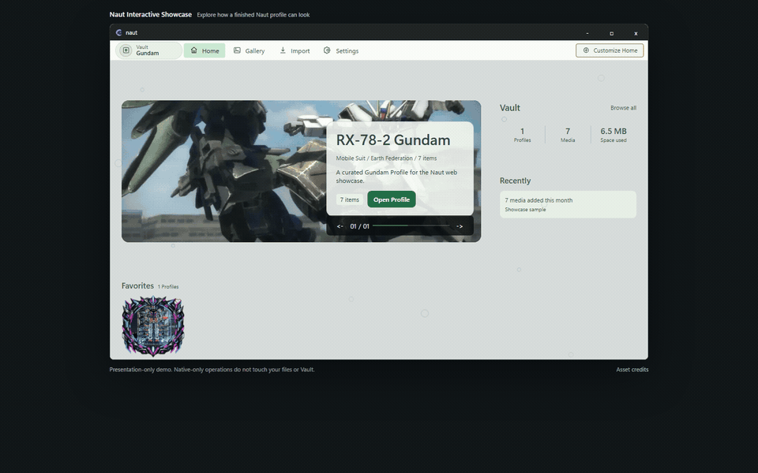

<strong>A Navigator for Your Things Worth Keeping</strong>

<a href="https://github.com/secondshift-dv/naut/releases/tag/v0.0.1"><strong>下载 Naut v0.0.1</strong></a> · <a href="https://secondshift-dv.github.io/naut/"><strong>在线演示</strong></a> · <a href="docs/README.md"><strong>文档</strong></a>

<a href="README.md">English</a> · <a href="README.de.md">Deutsch</a> · <a href="README.es.md">Español</a> · <a href="README.fr.md">Français</a> · <a href="README.id.md">Bahasa Indonesia</a> · <a href="README.ja.md">日本語</a> · <a href="README.ko.md">한국어</a> · <a href="README.zh-Hans.md">简体中文</a>

Naut 是面向 Windows 的 **本地优先媒体收藏管理器**。它以 Profile 为中心，在便携式 Vault 中组织图片、视频和可选的交互式 3D Figure。

导入会把文件复制到 Vault，原始文件保持不变。Cover、Banner、布局、Frame、Backdrop、Effect 和 Theme 都可以调整，而不会替换原始媒体。Figure 是基于 Direct3D 11 的可选负载；正常使用 Naut 不要求高端独立显卡。

从 **GitHub Releases** 下载 ZIP 并完整解压，运行 `naut.exe`，然后选择 Vault 文件夹。请参阅[文档](docs/README.md)和[系统要求](docs/system-requirements.md)。

Naut 自有源码依据 PolyForm Shield 1.0.0 以 **Source Available** 方式提供。官方二进制文件和签名更新元数据仅通过 `secondshift-dv/naut` 官方 **GitHub Releases** 发布。
