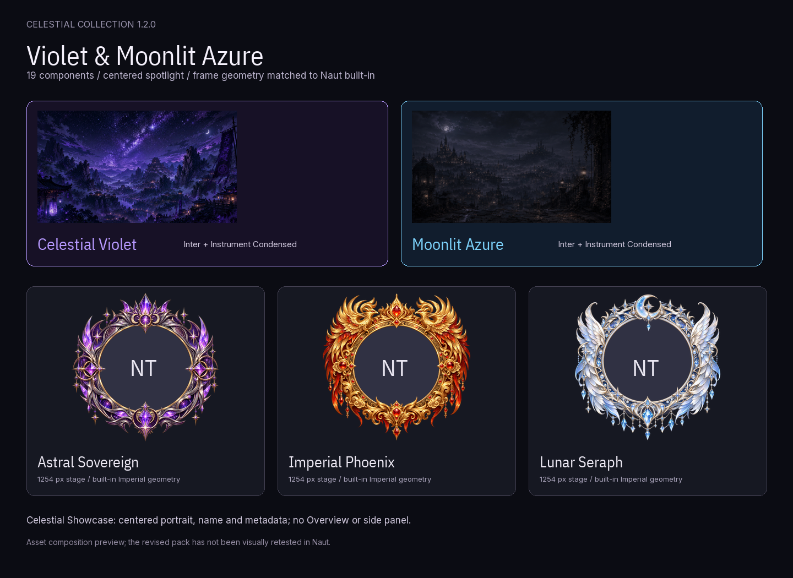

# Official optional packs

Give your collection another atmosphere. These packs are reviewed by Naut's
maintainer and installed only when you choose them. They are customization
content with independent versions; they do not replace the application.

## BLACK DOSSIER — 1.0.0

A neutral black cinematic collection with restrained crimson accents. Eleven independently selectable components, including bundled typography, separate Cover/Banner cards, the native Figure and a visible three-tier effect. Requires **Naut 0.0.6 or later**. Preview is an asset composition.

**[Download BLACK DOSSIER 1.0.0](https://secondshift-dv.github.io/naut/packs/black-dossier-1.0.0.ntpack)** · [Setup](black-dossier/README.md) · [Provenance](black-dossier/PROVENANCE.txt) · [Checksums](https://secondshift-dv.github.io/naut/packs/checksums.json)

## Overworld Expedition — 1.0.1

**A calm voxel expedition**: cream and moss colors, compact block controls,
collection shelves, three cozy backdrops and three cute square portrait frames.
17 independently selectable components. The Profile layout puts the media wall
before context and moves Delete to the bottom; the spotlight omits overview.
Sparse effects drift slowly and provide reduced-motion/static variants.
The preview is an asset composition, not a live app screenshot.

**[Download Overworld Expedition 1.0.1](https://secondshift-dv.github.io/naut/packs/overworld-expedition-1.0.1.ntpack)**
· [Checksums](https://secondshift-dv.github.io/naut/packs/checksums.json)
· [Setup and recommended components](overworld-expedition/README.md)
· [Pack source](overworld-expedition/pack.json)
· [Artwork/font provenance](overworld-expedition/PROVENANCE.txt)

Original artwork and definitions: CC BY 4.0, **Anas / Second Shift**.
Fonts retain OFL. Use Square Covers for the portrait frames.
Topbar colors share Naut's surface palette; page ornaments and Customize Card
size remain engine controlled.

## Celestial Collection · 1.2.0

**Violet and Moonlit Azure**, three ornate portrait frames, a centered spotlight,
compact layouts, atmospheric backdrops, stardust, typography and control styles.
19 independently selectable components. Frame geometry follows Naut's ornate
frame stage. The preview is an asset composition, not a live app screenshot.

**[Download Celestial 1.2.0](https://secondshift-dv.github.io/naut/packs/celestial-1.2.0.ntpack)**
· [Checksums](https://secondshift-dv.github.io/naut/packs/checksums.json)
· [Pack source](celestial/pack.json) · [Artwork/font provenance](celestial/PROVENANCE.txt)

In Naut, open **Settings → Presentation → Packs / Advanced → Install from file…**.
Select the downloaded `.ntpack`. Choose its components in Appearance or the
corresponding Customize screen, then **Save changes**. For an existing pack,
choose **Replace**. Installation does not select components automatically.

No new in-app Official badge is implied: imported packs use Naut's **User** label.
Official means reviewed and distributed from this repository's collection.

[Installation and updates](../docs/pack-collection.md)
· [Contribute a pack](../docs/contributing-packs.md)
