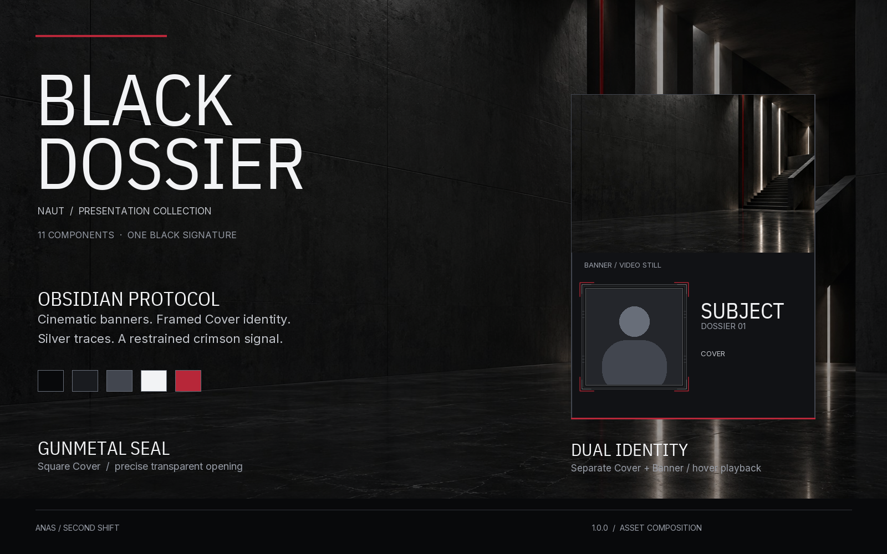

# BLACK DOSSIER 1.0.0

Neutral black. Cinematic identity. Restrained crimson.

**Requires Naut 0.0.6 or later** for selected Banner-video thumbnails and the card's explicit no-Cover-fallback image policy.

The preview is an asset board, not a live app screenshot. Inspired by the discipline of cinematic briefing interfaces; all artwork and branding here are original.

## Eleven independent components

| Component | Selection |
|---|---|
| Theme | Obsidian Protocol |
| Typography | Dossier Type |
| Home | Operations Desk |
| Spotlight | Opening Brief |
| Gallery | Dossier Wall |
| Card | Dual Identity |
| Profile | Subject Dossier |
| Media grid | Evidence Grid |
| Backdrop | Obsidian Atrium |
| Cover frame | Gunmetal Seal |
| Effect | Signal Trace |

## Install and select

Download the `.ntpack`, then open **Settings > Presentation > Packs / Advanced > Install from file**. Installation does not select components automatically. Select the theme and typography in Appearance; select each layout in its Customize screen and save changes. Select Obsidian Atrium for Home and/or Profile. Select Signal Trace independently for Home, Profile and Card. Imported components appear with the User label.

Use **Square** Covers with Gunmetal Seal. Cover is the framed identity portrait. Banner is the separately selected prepared video. Dual Identity shows that video's canonical thumbnail at rest, plays the same Banner on permitted hover, then returns to its thumbnail. Missing Banner/thumbnail leaves the black Banner area empty; it never substitutes Cover. Hover remains subject to Naut's scrolling, playback and resource policies. No runtime media generation is added.

Subject Dossier keeps the full Banner. The native Figure remains beside identity on wide screens and stacks on narrow screens with its existing pedestal and controls. Media comes first; context, review and Delete follow, with Delete at the bottom. Recent media follows the profile's visibility toggle.

Signal Trace uses 24 silver traces and a crimson sweep in Full; Reduced uses 12 traces and a slower sweep. Static fallback retains the grid and crimson glow. Reduced Motion uses the static fallback. Offscreen/minimized effects pause. No effect can be seen until it is selected and saved for the desired surface.

Original artwork and definitions: CC BY 4.0, Anas / Second Shift. Fonts retain OFL. See [provenance](PROVENANCE.txt) and [license](LICENSE.txt).
