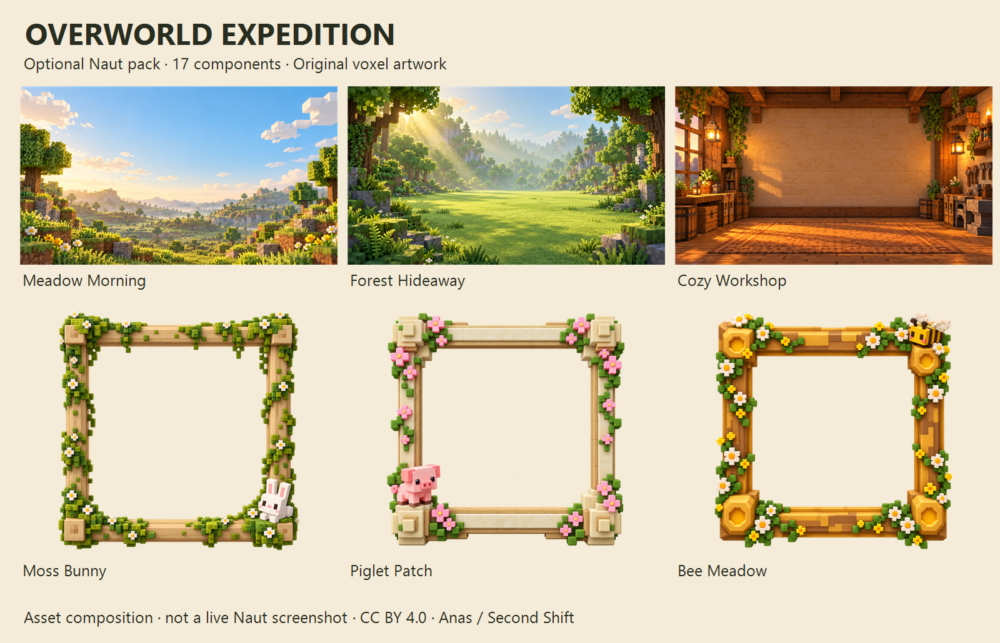

# Overworld Expedition — 1.0.1

A calm voxel expedition for your collection, by **Anas / Second Shift**.
17 independently selectable components. Install as an optional custom pack;
installation does not change your active components automatically.

The preview combines pack assets; it is not a screenshot of Naut.

## Install and explore

Download [Overworld Expedition 1.0.1](https://secondshift-dv.github.io/naut/packs/overworld-expedition-1.0.1.ntpack).
Open **Settings → Presentation → Packs / Advanced → Install from file**.
Choose the archive, select components in Appearance or the corresponding
Customize screen, and **Save changes**. Use **Replace** when updating this pack.

Recommended combination:

| Area | Component |
| --- | --- |
| Theme / typography / controls | Field Notes / Trail Journal / Blockcraft Controls |
| Home / spotlight | Base Camp / Trailhead Spotlight |
| Gallery / Profile cards | Trophy Shelves / Keepsake Card |
| Profile / media grid | Collection Lodge / Display Crates |
| Home backdrop / effect | Meadow Morning / Meadow Drift |
| Profile backdrop / effect | Cozy Workshop / Golden Dust |
| Alternative backdrop | Forest Hideaway |
| Square Cover frame | Moss Bunny, Piglet Patch or Bee Meadow |

Use a **Square** Cover shape for these frames. The portrait opening follows
Naut's frame stage: the ornament fills the stage and the Cover fits its opening.
Keepsake Card retains its framed portrait over a quiet banner background.
Hover plays the Profile video banner in that background when one is available.
The selected Cover frame appears on Home and Gallery;
this does not add ornament around the entire page or media grid.

Collection Lodge puts identity first, the full-width media wall second,
context afterward and actions, including Delete, last. Display Crates uses
square images, double borders and metadata below. Fill may crop a wide image;
open the media viewer to inspect the original.

## Calm, readable defaults

Static backdrops leave the central area quiet. The two effects have ten slow
particles, four in the reduced variant, and a static fallback. Offscreen
animation pauses. Pixel lettering is limited to display titles; headings,
names and body text use Inter.

Topbar contrast comes from the shared pale moss surface against the cream
canvas. Naut currently shares that surface with other panels; this pack cannot
give the topbar an independent color. Customize Card size, responsive page
ornaments and physical shelf decorations between media rows remain engine
controlled. Choose components individually; no application code is bundled.

## Credits and license

Original definitions and AI-assisted artwork: **CC BY 4.0**, credit
**Anas / Second Shift** and identify modifications. Fonts retain **SIL OFL 1.1**
and the notices in `licenses/`. See [provenance and generation prompts](PROVENANCE.txt)
and [license](LICENSE.txt).

Voxel-world inspiration is expressed through original artwork. No Minecraft
assets, logos or source files are included; this is an independent Naut pack.

[Collection](../README.md) · [Checksums](https://secondshift-dv.github.io/naut/packs/checksums.json)

## Changes in 1.0.1

Keepsake Card now supplies a banner media host and requests banner hover playback.
Original artwork, component ids and Profile/media ordering are preserved.
